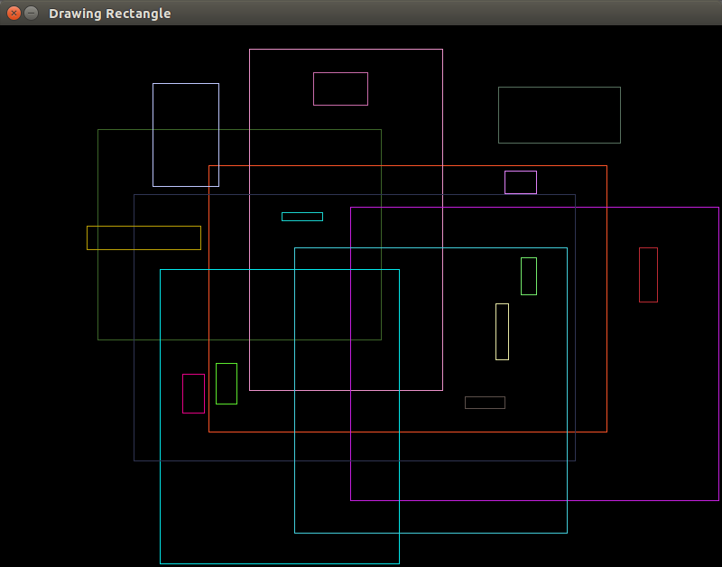
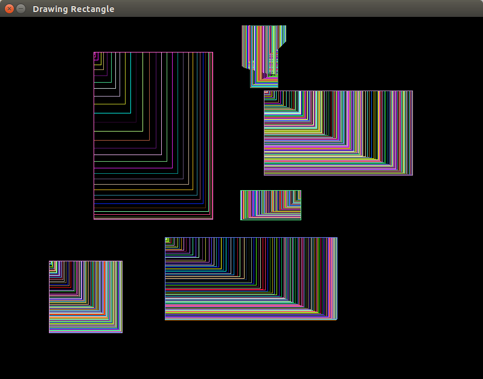

# Rectangles with Mouse in OpenCV

A simple and short program with Graphical User Interface for drawing rectangles with mouse clicking in OpenCV
DrawRectangles.cpp can generate pictures like 

, while DrawRectangles 2.cpp can generate pictures like 

